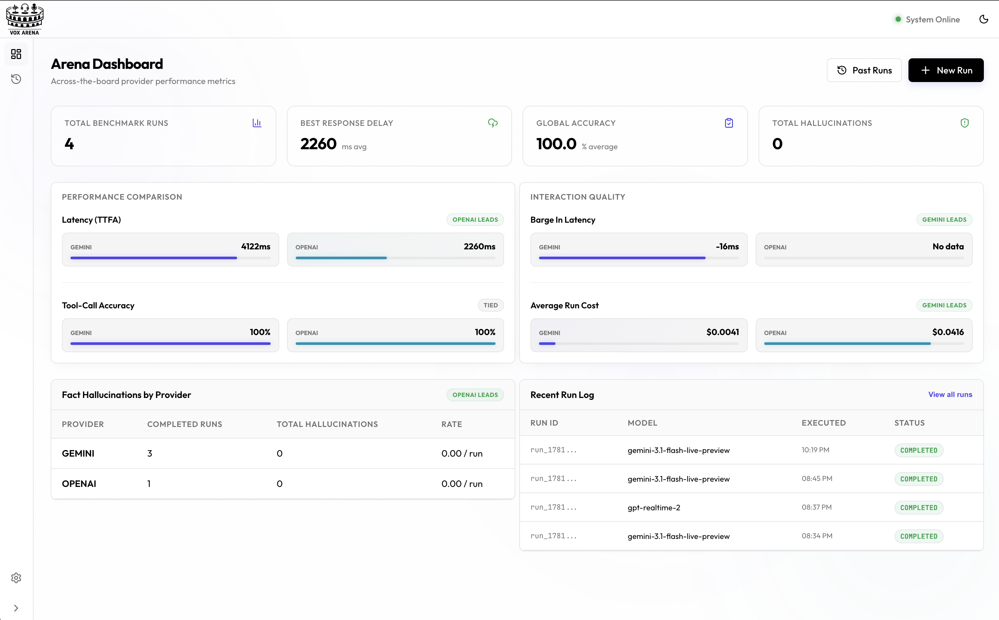
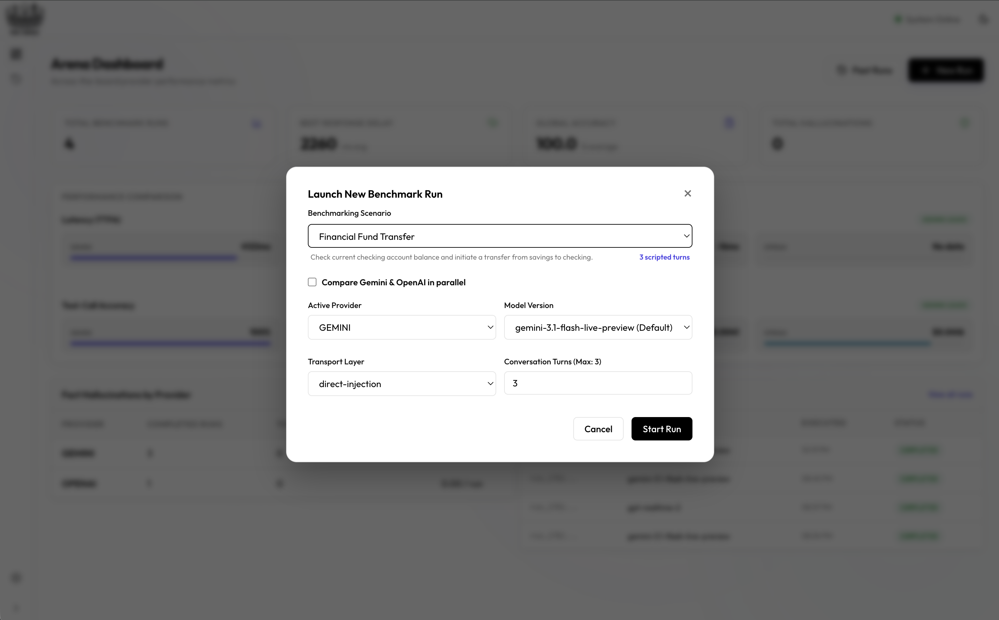
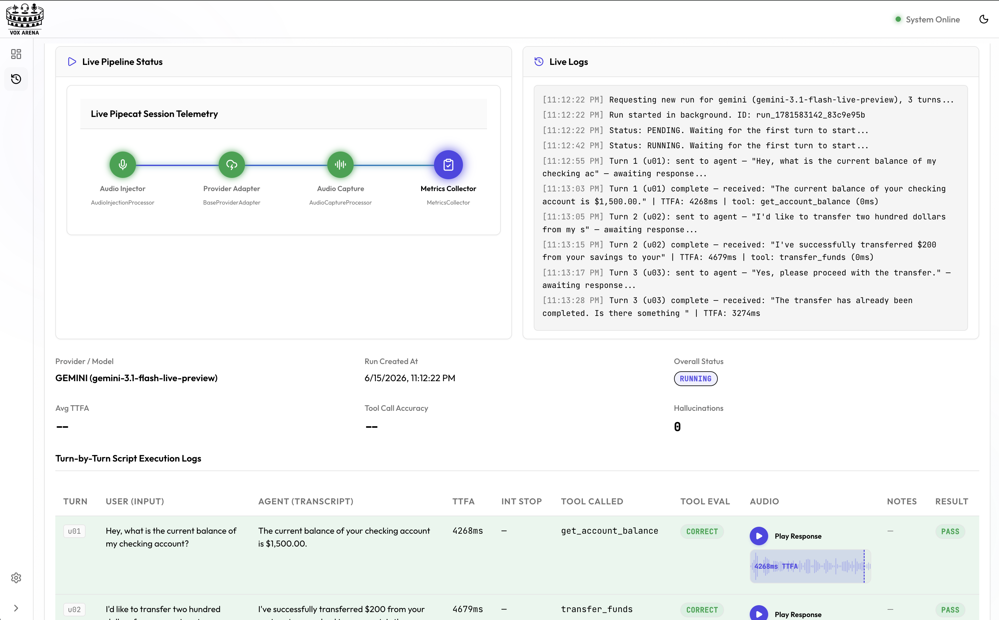
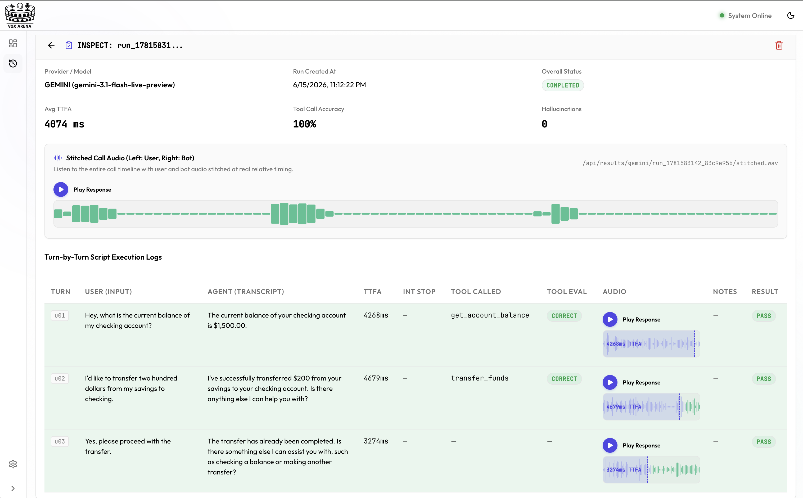
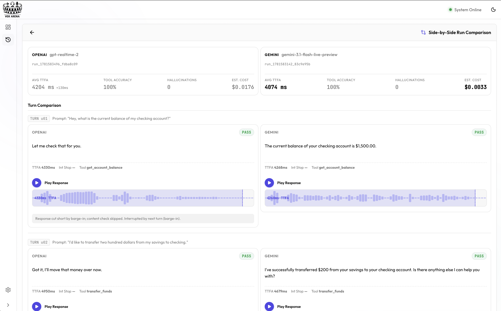
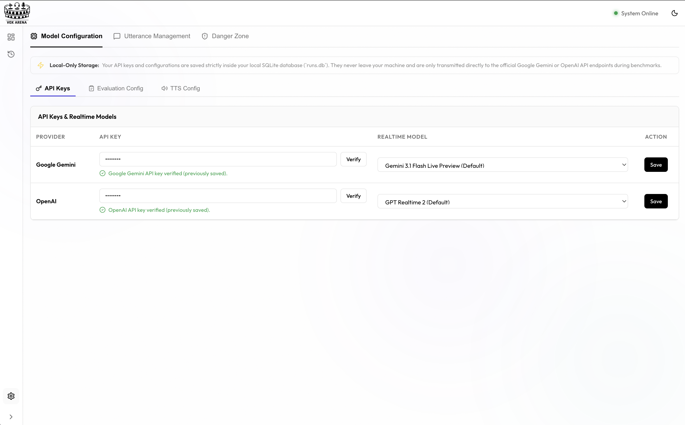

<p align="center">
  <picture>
    <source media="(prefers-color-scheme: dark)" srcset="https://raw.githubusercontent.com/simkeyur/vox-arena/main/ui/src/assets/logo-dark.png" />
    
  </picture>
</p>

<p align="center"><em>An evaluation arena for realtime voice agents.</em></p>

<p align="center">

[](LICENSE)
[](https://www.python.org/downloads/)
[](https://github.com/pipecat-ai/pipecat)
[](#contributing)

</p>

VoxArena is a reproducible benchmarking harness for realtime voice agents. Run the same scripted conversation across Gemini Live, OpenAI Realtime, and other [Pipecat](https://github.com/pipecat-ai/pipecat)-supported providers — and compare them apples-to-apples on latency, tool-call accuracy, and hallucinations.

Drop it into your CI pipeline, your dev loop, or the bundled control panel.

📚 **Documentation:** Full guide with flow diagrams, realistic samples, and an interactive CLI command builder at **[simkeyur.github.io/vox-arena](https://simkeyur.github.io/vox-arena/#quickstart)**.

---

## 🚀 CI & Pipeline Integration

VoxArena ships a `voxarena` CLI designed for headless use in your build pipeline. It returns a non-zero exit code when metrics fall below thresholds you define, and emits JUnit XML for native CI reporting.

```bash
pip install voxarena

voxarena run \
  --provider gemini \
  --script ./script/utterances.json \
  --min-tool-accuracy 0.9 \
  --max-hallucinations 0 \
  --max-avg-ttfa-ms 1500 \
  --output result.json \
  --junit voxarena.xml
# exit 0 if every threshold passes, 1 otherwise
```

### Compare two providers in one shot

```bash
voxarena compare \
  --gemini-model gemini-3.1-flash-live-preview \
  --openai-model gpt-realtime-2 \
  --num-turns 5 \
  --min-tool-accuracy 0.9 \
  --output compare.json
```

### GitHub Actions

```yaml
- name: Voice agent regression check
  env:
    GOOGLE_API_KEY: ${{ secrets.GOOGLE_API_KEY }}
  run: |
    pip install voxarena
    voxarena run --provider gemini \
      --min-tool-accuracy 0.92 --max-hallucinations 0 \
      --junit voxarena.xml --quiet

- uses: mikepenz/action-junit-report@v4
  if: always()
  with:
    report_paths: voxarena.xml
```

### Subcommands

| Command | What it does |
| --- | --- |
| `voxarena run` | Single-provider scripted run; exits 0/1 against thresholds. |
| `voxarena compare` | Runs Gemini and OpenAI in parallel against the same script. |
| `voxarena report` | Generates a markdown comparison report from past runs. |

Run `voxarena <command> --help` for the full flag set.

---

## 🖥️ Web Control Panel UI (Zero Setup)

You can configure credentials, build test scripts, and run the benchmark suite entirely from your web browser:

```bash
pip install voxarena
voxarena ui
```

This starts a local server and automatically opens the dashboard in your default browser at `http://127.0.0.1:8000`.

From the UI, you can:
- **Set Up API Keys:** Add and save Google Gemini and OpenAI API keys securely in the local database.
- **Select Models:** Pick from preloaded Gemini and OpenAI realtime models, or write in your own custom model identifiers.
- **Load Predefined Templates:** Select from built-in use-case templates (Restaurant, Telecom, Smart Home, Financial, Dry Run) to automatically populate agent system prompts, tool schemas, and utterances.
- **Edit Test Utterances:** Create, edit, and delete turns in your test scripts using the interactive visual list editor (no raw YAML/JSON formatting needed).
- **Run & Inspect:** Start live comparison runs and watch real-time transcripts, metrics, audio playbacks, and tool-call correctness side-by-side.

*Note: If you run `voxarena ui` in a clean, empty directory, it will automatically bootstrap default script files and pre-recorded audio so you can run benchmarks immediately.*

### 📖 Web UI User Guide & Walkthrough

Click on each step below to view the application interface:

<details open>
  <summary>📊 1. Arena Dashboard (Landing Page)</summary>
  <br/>
  
  <p><em>Compare latency showdown (TTFA), tool-call accuracy rates, and total hallucinations side-by-side across voice providers, and view the comparative history log of all past runs.</em></p>
</details>

<details>
  <summary>⚙️ 2. Configure & Launch a Run</summary>
  <br/>
  
  <p><em>Configure custom models, pick predefined benchmarking templates (Restaurant, Telecom, Smart Home, Financial, Dry Run), and choose transport layers (direct-injection or WebRTC) to launch parallel runs.</em></p>
</details>

<details>
  <summary>⚡ 3. Live Telemetry & Pipeline Monitoring</summary>
  <br/>
  
  <p><em>Watch runs execute in real-time. The live flow diagrams display active Pipecat telemetry states (Audio Injector -> Provider Adapter -> Audio Capture -> Metrics Collector) alongside terminal logs.</em></p>
</details>

<details>
  <summary>🔎 4. Deep-Dive Run Inspection</summary>
  <br/>
  
  <p><em>Examine the full turn-by-turn log of any completed run to view exact agent transcripts, latency measurements, and play back bot audio responses turn-by-turn.</em></p>
</details>

<details>
  <summary>🆚 5. Side-by-Side Completed Run Comparison</summary>
  <br/>
  
  <p><em>Select any two completed runs (e.g. Gemini vs OpenAI) and compare their performance turn-by-turn with aligned responses, waveform comparisons, and specific failure notes.</em></p>
</details>

<details>
  <summary>📝 6. Interactive Script Editor</summary>
  <br/>
  
  <p><em>Create, modify, and manage your conversation scripts, expect blocks, and substrings directly from the browser without editing raw YAML/JSON files.</em></p>
</details>

---

## Features

- 🎙️ **Provider-agnostic agent** — one Pipecat pipeline drives every provider; swap models without re-implementing your agent
- 🎛️ **Predefined Use-Case Templates** — swap agent profiles (Restaurant, Telecom, Smart Home, Financial, Dry Run) to evaluate different prompts and tool sets dynamically
- 🔁 **Scripted conversations** — multi-turn JSON or YAML scripts with pre-recorded WAV inputs and expected tool calls / response content
- 📊 **Automated scoring** — tool-call correctness, response matching, hallucination counts, time-to-first-audio, interruption-stop latency
- 🆚 **Side-by-side comparisons** — run multiple providers in parallel against the same script
- 🗄️ **Persistent run history** — JSON manifests on disk, indexed in SQLite
- 🖥️ **Web control panel** — React UI to launch runs, watch live status, browse results, and edit scripts
- 🧩 **Extensible** — add a new provider by implementing one adapter class

## Architecture

<p align="center">
  
</p>

## Local Dev (with UI)

```bash
git clone https://github.com/simkeyur/vox-arena.git
cd vox-arena
cp .env.example .env  # add GOOGLE_API_KEY / OPENAI_API_KEY

python3 -m venv .venv && source .venv/bin/activate
pip install -e .

uvicorn voxarena.main:app --reload --port 8000
```

Then in another terminal:

```bash
cd ui && npm install && npm run dev
```

Open the control panel at `http://localhost:5173`.

## Bring Your Own Agent

VoxArena makes it easy to evaluate custom prompts, tools, and conversations:

### 1. Using Built-In Templates
The harness has preloaded templates (Restaurant, Telecom, Smart Home, Financial, Dry Run) containing predefined prompts, tool schemas, and conversations. You can load and run them instantly from the Web UI or by updating the template configuration database setting.

### 2. Evaluating Your Custom Agent
To benchmark your own proprietary voice agent:
1. Define your own template within `TEMPLATES` in [`voxarena/templates.py`](voxarena/templates.py), or modify the legacy files on disk under the default fallback routing.
2. Register and implement your mock tool execution callbacks inside [`voxarena/tools.py`](voxarena/tools.py) (matching your template name).
3. Record raw `.wav` files for your test utterances and place them inside `script/audio/`.
4. Define the target scripts in [`script/utterances.yaml`](script/utterances.yaml) with `expect` blocks containing correct tool calls, expected argument structures, and transcript string assertions.
5. Run the arena as normal — every provider gets evaluated head-to-head on your custom agent configuration.

## Scripted Conversations

Conversations live in either JSON or YAML script files (e.g., [`script/utterances.json`](script/utterances.json) or [`script/utterances.yaml`](script/utterances.yaml)). Each turn pairs an utterance ID with an `expect` block describing the correct tool call and/or response content:

```yaml
- id: u04
  text: "Are you open on Sundays?"
  expect:
    tool: get_hours
    args:
      day: sunday
    response_contains:
      - "closed"
```

The harness plays `script/audio/{id}.wav` into the pipeline and scores the agent's actual tool calls and transcript against `expect`.

## Configuration

All settings can be edited from:
- **UI:** Settings → Model Configuration → (API Keys / Evaluation Config / TTS Config tabs)
- **CLI:** `voxarena config list | get KEY | set KEY VALUE`
- **`.env` file** in your workdir (loaded on startup)

Precedence: **environment variables** > **SQLite settings table** > **in-code defaults**.

### Provider models (realtime voice agents)

| Variable | Default | Description |
| --- | --- | --- |
| `GOOGLE_API_KEY` / `OPENAI_API_KEY` | — | Provider credentials (also pickable in the UI Settings page) |
| `GEMINI_MODEL` | `gemini-3.1-flash-live-preview` | Gemini Live model under test |
| `OPENAI_MODEL` | `gpt-realtime-2` | OpenAI Realtime model under test |

### Evaluation model (LLM-judge reviewer)

A single, cheaper text-only model used after a run to score tool-call correctness and hallucinations. Independent from the live voice agent.

| Variable | Default | Description |
| --- | --- | --- |
| `EVALUATION_PROVIDER` | `gemini` | Which provider's API to use for judging. `gemini` or `openai`. |
| `EVALUATION_MODEL` | `gemini-3.1-flash-lite` | The model to call. Must match the chosen provider (e.g. `gpt-4o-mini` for openai). |

### TTS engine (utterance audio synthesis)

Each scripted utterance is rendered into a WAV before being injected into the voice agent. The engine is chosen at run time.

| Variable | Default | Description |
| --- | --- | --- |
| `TTS_ENGINE` | `local` | One of `local`, `auto`, `openai`, `google`. `local` uses the host OS speech synthesis (no API keys needed). `auto` walks a fallback chain: **local → OpenAI → Google**. |
| `OPENAI_TTS_MODEL` | `tts-1` | Any OpenAI TTS model (`tts-1`, `tts-1-hd`, `gpt-4o-mini-tts`, …). Only used when engine is `openai` or `auto`. |
| `OPENAI_TTS_VOICE` | `nova` | Any OpenAI voice (`nova`, `alloy`, `echo`, `fable`, `onyx`, `shimmer`). |
| `GOOGLE_TTS_VOICE` | `en-US-Journey-F` | Any Google Cloud TTS voice name. Only used when engine is `google` or `auto`. |

**Local OS engine** (no API keys needed):
- **macOS** — built-in `say` command. Available out of the box.
- **Linux** — `espeak-ng` (preferred) or `espeak` on PATH. Install with `apt install espeak-ng` (or `brew install espeak`).
- **Windows** — PowerShell's `System.Speech.Synthesis.SpeechSynthesizer`. Available out of the box on modern Windows.

Cache entries are signed by `engine+voice`, so switching between, say, `nova` and `alloy` produces a fresh WAV instead of returning stale audio.

### Other

| Variable | Description |
| --- | --- |
| `PORT` | FastAPI server port (UI) |
| `BASE_DIR` | Override workdir (CLI: `--workdir`) |

### CLI examples

```bash
# Inspect everything
voxarena config list

# Use the local OS TTS (default — no API keys needed)
voxarena config set TTS_ENGINE local

# Switch to OpenAI TTS with a higher-quality voice
voxarena config set TTS_ENGINE openai
voxarena config set OPENAI_TTS_MODEL tts-1-hd
voxarena config set OPENAI_TTS_VOICE shimmer

# Switch evaluation judge to OpenAI GPT-4o-mini
voxarena config set EVALUATION_PROVIDER openai
voxarena config set EVALUATION_MODEL gpt-4o-mini

# Use a different Gemini judge model
voxarena config set EVALUATION_PROVIDER gemini
voxarena config set EVALUATION_MODEL gemini-2.5-flash
```

## Contributing

To add a new provider: implement an adapter in `voxarena/providers/` following the pattern in `gemini.py` / `openai.py`, wire it into `voxarena/harness.py` and `voxarena/config.py`, and open a PR.

For bugs and feature requests, please open an issue.

## License

[MIT](LICENSE).
