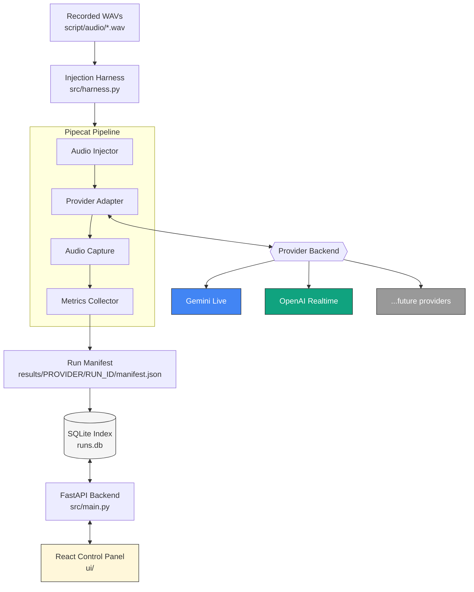

# Voice Agent Bake-off

[](LICENSE)
[](https://www.python.org/downloads/)
[](https://github.com/pipecat-ai/pipecat)
[](#contributing)

A reproducible **bake-off harness for realtime voice agents** — run the exact same scripted conversation against multiple realtime LLM providers (Google Gemini Live, OpenAI Realtime, and more via [Pipecat](https://github.com/pipecat-ai/pipecat)), and compare them side-by-side on latency, tool-call accuracy, transcript fidelity, and hallucinations.

One agent. One prompt. One tool schema. One set of pre-recorded audio scripts. Many providers, fairly compared.

---

## Why

Picking a realtime voice provider usually means re-implementing your agent for each vendor and eyeballing demo calls. This project keeps everything **except the provider** constant — same system prompt, same tools, same scripted audio inputs — and automatically scores each run against expected tool calls and expected response content, so you get an apples-to-apples comparison.

## Features

- 🎙️ **Provider-agnostic agent** — a single demo agent ("Saffron Leaf" restaurant assistant) driven through a shared [Pipecat](https://github.com/pipecat-ai/pipecat) pipeline
- 🔁 **Scripted conversations** — define multi-turn conversations as pre-recorded WAV inputs + expected tool calls/responses in YAML
- 📊 **Automated scoring** — tool-call correctness, response-content matching, hallucination counting, time-to-first-audio, interruption-stop latency
- 🆚 **Side-by-side comparisons** — run Gemini Live and OpenAI Realtime in parallel against the same script
- 🗄️ **Persistent run history** — every run is saved as a JSON manifest and indexed in SQLite
- 🖥️ **Web control panel** — React UI to launch runs, watch live status, browse results in a sortable table, and tweak models/utterances from a Settings screen
- 🧩 **Extensible** — add a new provider by implementing one adapter class

## Architecture



- **`src/agent.py`** — the shared agent definition (system prompt + tool schemas), versioned and hashed for reproducibility
- **`src/providers/`** — per-vendor adapters (`gemini.py`, `openai.py`) that wrap each Pipecat realtime LLM service behind a common interface, plus shared `RunMetricsCollector` scoring logic in `base.py`
- **`src/harness.py`** — drives a scripted conversation through the pipeline: injects audio turn-by-turn, captures responses, scores them against expectations
- **`src/main.py`** — FastAPI backend exposing run management, results, and settings endpoints
- **`ui/`** — React + Vite control panel

## Getting Started

### Prerequisites

- Python 3.11+
- Node.js 18+ (for the UI)
- API keys for at least one provider: [Google AI Studio](https://aistudio.google.com/) (Gemini) and/or [OpenAI](https://platform.openai.com/) (Realtime API)

### 1. Clone and configure

```bash
git clone https://github.com/<your-org>/voice-agent-bakeoff.git
cd voice-agent-bakeoff
cp .env.example .env
# edit .env and add your GOOGLE_API_KEY / OPENAI_API_KEY
```

### 2. Backend setup

```bash
python3 -m venv .venv
source .venv/bin/activate
pip install -r requirements.txt

uvicorn src.main:app --reload --port 8000
```

### 3. Frontend setup

```bash
cd ui
npm install
npm run dev
```

The control panel runs at `http://localhost:5173` and talks to the API at `http://localhost:8000`.

### 4. Run a bake-off

From the UI:

1. Pick a provider/model (or check "Run both in parallel" to compare Gemini and OpenAI side-by-side)
2. Choose how many conversation turns to run
3. Click **Start Run** and watch live status
4. Open the completed run to see per-turn results — transcript, tool calls, latency, pass/fail, and audio playback

Or via the API directly:

```bash
curl -X POST http://localhost:8000/api/run \
  -H "Content-Type: application/json" \
  -d '{"provider": "gemini", "model": "gemini-3.1-flash-live-preview", "transport": "direct-injection", "num_turns": 5}'
```

## Configuration

All configuration lives in `.env` (see `.env.example`):

| Variable | Description |
| --- | --- |
| `GOOGLE_API_KEY` | API key for Gemini Live |
| `OPENAI_API_KEY` | API key for OpenAI Realtime |
| `GEMINI_MODEL` / `OPENAI_MODEL` | Realtime model used for the agent under test |
| `GEMINI_EVAL_MODEL` / `OPENAI_EVAL_MODEL` | Cheaper text models used for grading/eval |
| `PORT` | FastAPI server port |

Model names and the scripted conversation (`script/utterances.yaml`) can also be edited live from the **Settings** screen in the UI.

## Scripted Conversations

Conversations are defined in [`script/utterances.yaml`](script/utterances.yaml) as a list of turns, each with audio input and an `expect` block describing the correct tool call and/or response content:

```yaml
- id: u04
  text: "Are you open on Sundays?"
  expect:
    tool: get_hours
    args:
      day: sunday
    response_contains:
      - "closed"
```

The harness plays the corresponding `script/audio/{id}.wav` file into the pipeline and scores the agent's actual tool calls and transcript against `expect`.

## Project Structure

```text
.
├── src/                # FastAPI backend, harness, providers, agent, tools
├── ui/                 # React control panel
├── script/             # Scripted utterances + audio inputs
├── results/            # Run manifests (JSON) + SQLite index (gitignored)
├── spec/               # Design spec and contracts
└── requirements.txt
```

## Contributing

Contributions are welcome! To add a new provider:

1. Implement an adapter in `src/providers/` following the pattern in `gemini.py` / `openai.py`
2. Wire it into `src/harness.py` and `src/config.py`
3. Submit a PR

For bugs and feature requests, please open an issue.

## License

This project is licensed under the [MIT License](LICENSE).
